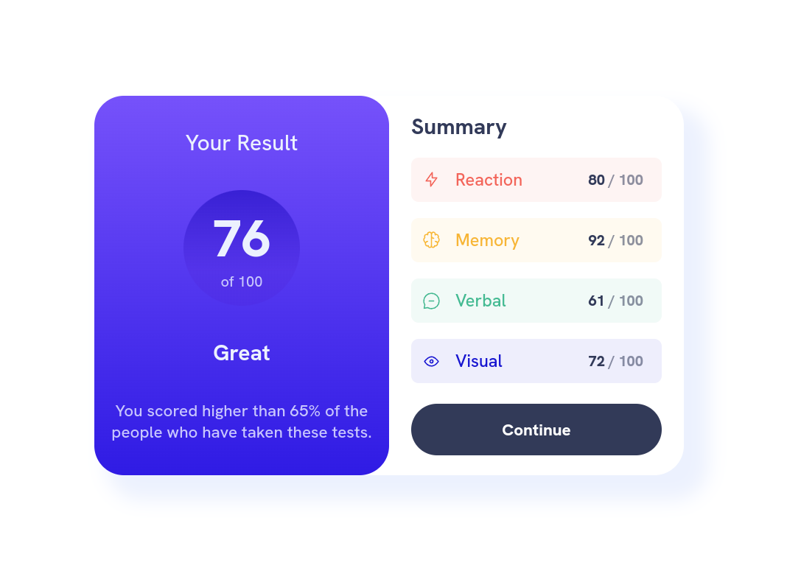
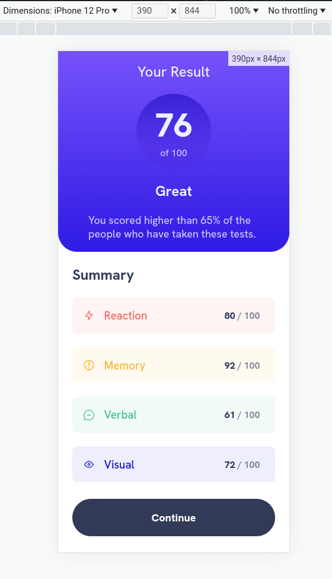

# Frontend Mentor - Results summary component solution

This is a solution to the [Results summary component challenge on Frontend Mentor](https://www.frontendmentor.io/challenges/results-summary-component-CE_K6s0maV). Frontend Mentor challenges help you improve your coding skills by building realistic projects.

## Table of contents

-   [Overview](#overview)
    -   [The challenge](#the-challenge)
    -   [Screenshot](#screenshot)
    -   [Links](#links)
-   [My process](#my-process)
    -   [Built with](#built-with)
    -   [What I learned](#what-i-learned)
-   [Author](#author)

## Overview

### The challenge

Users should be able to:

-   View the optimal layout for the interface depending on their device's screen size
-   See hover and focus states for all interactive elements on the page
-   **Bonus**: Use the local JSON data to dynamically populate the content

### Screenshot




### Links

-   Solution URL: [Github](https://github.com/GabeGar/FM-results-summary-component)
-   Live Site URL: [GH-Pages](https://your-live-site-url.com)

## My process

### Built with

-   [React](https://reactjs.org/) - JS library
-   [Vite](https://vitejs.dev/)
-   Mobile-first workflow
-   CSS custom properties
-   Flexbox

### What I learned

-   Utilizing dynamic fonts and importing fonts via @font-face syntax, in css.

-   Utilized the built-in fetch api in javascript, via react, to get the data dynamically, from the provided data.json file.
    It had to be placed in the public folder, to be served to anyone accessing the page. Happens after mounting the app component.

```js - react
// * In app component
useEffect(() => {
    const fetchData = async () => {
        // * Loading state would default to true here.
        try {
            const res = await fetch("/data.json");

            // * Can throw error here to later handle said error (if one ever occurred during the fetching process)
            if (!res.ok) fetchData();

            const data = await res.json();
            setYourStats(data);
        } catch (err) {
            // * Error handling here and/or trigger some sort of error state.
            console.log(err);
        } finally {
            // * End of loading state.
        }
    };

    fetchData();
}, []);

// * Conditional in app to prevent error, since data doesn't exist without fetching (which happens after app has mounted, in useEffect).
if (yourStats.length === 0) return;
```

-   While I could've/should've properly handled states for loading and error, respectively, I kept it simple,
    to allow myself to focus on the more heavily involved css.

## Author

-   Frontend Mentor - [@GabeGar](https://www.frontendmentor.io/profile/GabeGar)
